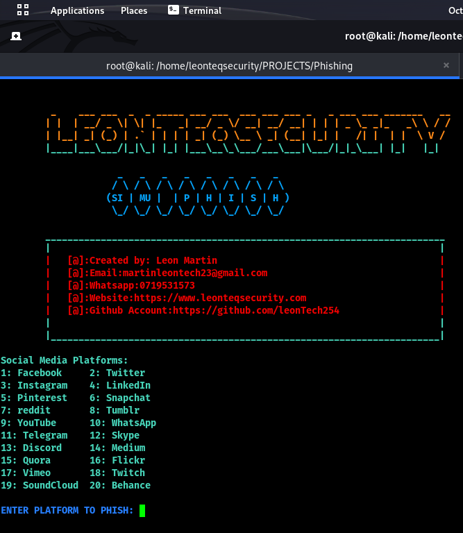
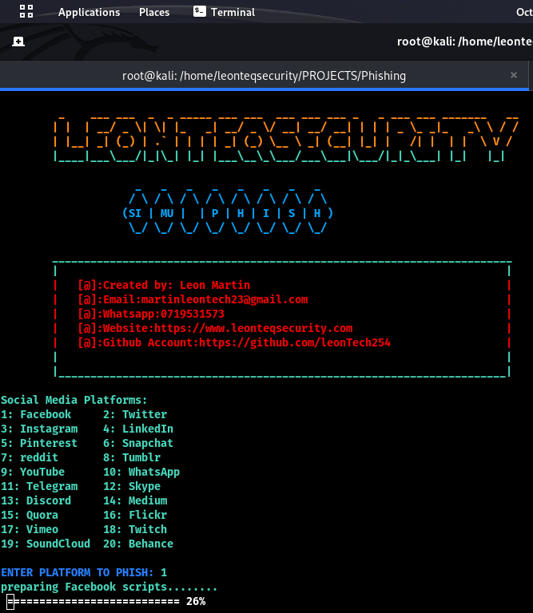

# SimuPhish
This project provides a simple phishing simulation using Python, ngrok and Bash.
### Menu

### Progress script

# launch.sh
This Bash script automates setting up and launching the phishing simulation.
## Overview

The script does the following:

- Installs required packages like Python
- Sets up Python virtual environment 
- Installs Python packages needed 
- Generates a random port for the web server
- Checks for and kills any processes using the port
- Launches the Python Flask app in the background
- Authenticates and starts ngrok with the generated port
- Provides commands to run as a normal user for testing

## Usage

Run the script as root:

```bash
sudo ./start.sh
```

It will automatically install dependencies, generate certificates, and start the mock phishing server accessible over ngrok.

The output URL will be printed which can be shared for the simulation. 

Ctrl+C stops the server and kills the ngrok tunnel.

## Configuration

- `target_port` - Port range to randomly choose from
- `auth.txt` - ngrok auth token file
- `packageRequirements` - Python packages to install

Update these as needed.

## Flow

The main steps are:

1. Install system packages 
2. Create and activate Python virtualenv
3. Install Python packages
4. Generate random target port
5. Terminate any process on port
6. Launch Flask app in background
7. Authenticate and start ngrok


## Contributing

Open issues or PRs to contribute enhancements or fixes!
Let me know if any part needs more explanation or if additional sections would be helpful!